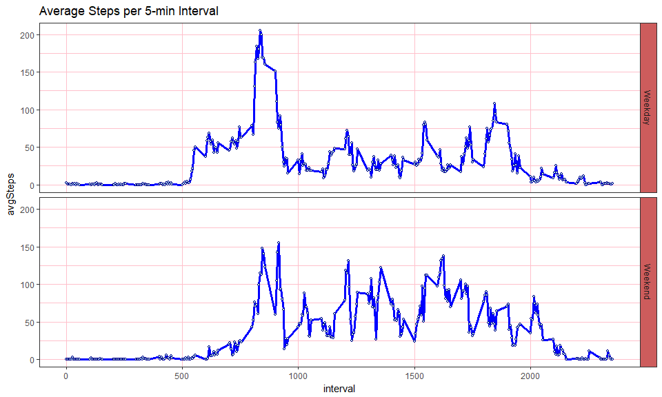

# Reproducible Research: Peer Assessment 1
Mike Wehinger  
November 2016  

## 1. Loading and processing the data
The data will be stored in a dataframe called, *activity* and has 17,568 observations from a personal activity monitoring device. 

A quick look at the data shows,

* it is comprised of 61 days, 1-Oct to 30-Nov
* there are 17,568 observations
* There are 288 observations per day (which matches what you expect from 5-minute intervals over a 24 hour period)

In addition, the *activity* data was transformed to summarize steps by day and by interval, the *dailyStats* and *intervalStats* respectively


```r
setwd("C:/Users/Mike/Documents/Projects/dataScience/ReproducibleResearch/RepData_PeerAssessment1")
library(xtable)
library(dplyr)
library(ggplot2)
```


```r
#read data from file to dataframe...
activity <- read.csv(unz(description = "activity.zip", "activity.csv"))

# transform data to summarize by day and interval...
dailyStats <- group_by(activity, date) %>% summarize(avgSteps = mean(steps,na.rm=TRUE), medianSteps = median(steps,na.rm=TRUE), totalSteps = sum(steps,na.rm=TRUE))

intervalStats <- group_by(activity, interval) %>% summarize(avgSteps = mean(steps,na.rm=TRUE), medianSteps = median(steps,na.rm=TRUE), totalSteps = sum(steps,na.rm=TRUE))

# Add a time element to the interval transformation to make intervals more intuitive (e.g. time of day)
timeInterval <- seq(as.POSIXct("2012-11-30 00:00:00"),as.POSIXct("2012-11-30 23:55:00"),by="5 mins")
intervalStats <- cbind(intervalStats, timeInterval)

head(activity)
```

```
##   steps       date interval
## 1    NA 2012-10-01        0
## 2    NA 2012-10-01        5
## 3    NA 2012-10-01       10
## 4    NA 2012-10-01       15
## 5    NA 2012-10-01       20
## 6    NA 2012-10-01       25
```

```r
head(dailyStats)
```

```
## # A tibble: 6 × 4
##         date avgSteps medianSteps totalSteps
##       <fctr>    <dbl>       <dbl>      <int>
## 1 2012-10-01      NaN          NA          0
## 2 2012-10-02  0.43750           0        126
## 3 2012-10-03 39.41667           0      11352
## 4 2012-10-04 42.06944           0      12116
## 5 2012-10-05 46.15972           0      13294
## 6 2012-10-06 53.54167           0      15420
```

```r
head(intervalStats)
```

```
##   interval  avgSteps medianSteps totalSteps        timeInterval
## 1        0 1.7169811           0         91 2012-11-30 00:00:00
## 2        5 0.3396226           0         18 2012-11-30 00:05:00
## 3       10 0.1320755           0          7 2012-11-30 00:10:00
## 4       15 0.1509434           0          8 2012-11-30 00:15:00
## 5       20 0.0754717           0          4 2012-11-30 00:20:00
## 6       25 2.0943396           0        111 2012-11-30 00:25:00
```


## 2. Steps taken each day - histogram 

The histogram shows that the individual often takes between 10,000 and 15,000 steps in a day,
however, looks skewed towards zero steps

```r
hist(dailyStats$totalSteps)
```


## 3. Mean/Median Steps taken each day 

On average, this individual takes 9354 steps per day. The median number of steps per day is 10395


We see that the daily median number of steps equals zero. This may be because many of the readings are taken during times when an individual wouldnt be walking around. For example, not representing only *awake hours*. The five minute intervals start near midnight and register zero for many hours, presumably, while the individual is sleeping.

The table below shows, for each day, the total, average, and median number of steps taken


```r
print(xtable(dailyStats), type="html", auto=TRUE)
```

<!-- html table generated in R 3.2.3 by xtable 1.8-2 package -->
<!-- Sat Nov 12 21:42:19 2016 -->
<table border=1>
<tr> <th>  </th> <th> date </th> <th> avgSteps </th> <th> medianSteps </th> <th> totalSteps </th>  </tr>
  <tr> <td align="right"> 1 </td> <td> 2012-10-01 </td> <td align="right">  </td> <td align="right">  </td> <td align="right">   0 </td> </tr>
  <tr> <td align="right"> 2 </td> <td> 2012-10-02 </td> <td align="right"> 0.44 </td> <td align="right"> 0.00 </td> <td align="right"> 126 </td> </tr>
  <tr> <td align="right"> 3 </td> <td> 2012-10-03 </td> <td align="right"> 39.42 </td> <td align="right"> 0.00 </td> <td align="right"> 11352 </td> </tr>
  <tr> <td align="right"> 4 </td> <td> 2012-10-04 </td> <td align="right"> 42.07 </td> <td align="right"> 0.00 </td> <td align="right"> 12116 </td> </tr>
  <tr> <td align="right"> 5 </td> <td> 2012-10-05 </td> <td align="right"> 46.16 </td> <td align="right"> 0.00 </td> <td align="right"> 13294 </td> </tr>
  <tr> <td align="right"> 6 </td> <td> 2012-10-06 </td> <td align="right"> 53.54 </td> <td align="right"> 0.00 </td> <td align="right"> 15420 </td> </tr>
  <tr> <td align="right"> 7 </td> <td> 2012-10-07 </td> <td align="right"> 38.25 </td> <td align="right"> 0.00 </td> <td align="right"> 11015 </td> </tr>
  <tr> <td align="right"> 8 </td> <td> 2012-10-08 </td> <td align="right">  </td> <td align="right">  </td> <td align="right">   0 </td> </tr>
  <tr> <td align="right"> 9 </td> <td> 2012-10-09 </td> <td align="right"> 44.48 </td> <td align="right"> 0.00 </td> <td align="right"> 12811 </td> </tr>
  <tr> <td align="right"> 10 </td> <td> 2012-10-10 </td> <td align="right"> 34.38 </td> <td align="right"> 0.00 </td> <td align="right"> 9900 </td> </tr>
  <tr> <td align="right"> 11 </td> <td> 2012-10-11 </td> <td align="right"> 35.78 </td> <td align="right"> 0.00 </td> <td align="right"> 10304 </td> </tr>
  <tr> <td align="right"> 12 </td> <td> 2012-10-12 </td> <td align="right"> 60.35 </td> <td align="right"> 0.00 </td> <td align="right"> 17382 </td> </tr>
  <tr> <td align="right"> 13 </td> <td> 2012-10-13 </td> <td align="right"> 43.15 </td> <td align="right"> 0.00 </td> <td align="right"> 12426 </td> </tr>
  <tr> <td align="right"> 14 </td> <td> 2012-10-14 </td> <td align="right"> 52.42 </td> <td align="right"> 0.00 </td> <td align="right"> 15098 </td> </tr>
  <tr> <td align="right"> 15 </td> <td> 2012-10-15 </td> <td align="right"> 35.20 </td> <td align="right"> 0.00 </td> <td align="right"> 10139 </td> </tr>
  <tr> <td align="right"> 16 </td> <td> 2012-10-16 </td> <td align="right"> 52.38 </td> <td align="right"> 0.00 </td> <td align="right"> 15084 </td> </tr>
  <tr> <td align="right"> 17 </td> <td> 2012-10-17 </td> <td align="right"> 46.71 </td> <td align="right"> 0.00 </td> <td align="right"> 13452 </td> </tr>
  <tr> <td align="right"> 18 </td> <td> 2012-10-18 </td> <td align="right"> 34.92 </td> <td align="right"> 0.00 </td> <td align="right"> 10056 </td> </tr>
  <tr> <td align="right"> 19 </td> <td> 2012-10-19 </td> <td align="right"> 41.07 </td> <td align="right"> 0.00 </td> <td align="right"> 11829 </td> </tr>
  <tr> <td align="right"> 20 </td> <td> 2012-10-20 </td> <td align="right"> 36.09 </td> <td align="right"> 0.00 </td> <td align="right"> 10395 </td> </tr>
  <tr> <td align="right"> 21 </td> <td> 2012-10-21 </td> <td align="right"> 30.63 </td> <td align="right"> 0.00 </td> <td align="right"> 8821 </td> </tr>
  <tr> <td align="right"> 22 </td> <td> 2012-10-22 </td> <td align="right"> 46.74 </td> <td align="right"> 0.00 </td> <td align="right"> 13460 </td> </tr>
  <tr> <td align="right"> 23 </td> <td> 2012-10-23 </td> <td align="right"> 30.97 </td> <td align="right"> 0.00 </td> <td align="right"> 8918 </td> </tr>
  <tr> <td align="right"> 24 </td> <td> 2012-10-24 </td> <td align="right"> 29.01 </td> <td align="right"> 0.00 </td> <td align="right"> 8355 </td> </tr>
  <tr> <td align="right"> 25 </td> <td> 2012-10-25 </td> <td align="right"> 8.65 </td> <td align="right"> 0.00 </td> <td align="right"> 2492 </td> </tr>
  <tr> <td align="right"> 26 </td> <td> 2012-10-26 </td> <td align="right"> 23.53 </td> <td align="right"> 0.00 </td> <td align="right"> 6778 </td> </tr>
  <tr> <td align="right"> 27 </td> <td> 2012-10-27 </td> <td align="right"> 35.14 </td> <td align="right"> 0.00 </td> <td align="right"> 10119 </td> </tr>
  <tr> <td align="right"> 28 </td> <td> 2012-10-28 </td> <td align="right"> 39.78 </td> <td align="right"> 0.00 </td> <td align="right"> 11458 </td> </tr>
  <tr> <td align="right"> 29 </td> <td> 2012-10-29 </td> <td align="right"> 17.42 </td> <td align="right"> 0.00 </td> <td align="right"> 5018 </td> </tr>
  <tr> <td align="right"> 30 </td> <td> 2012-10-30 </td> <td align="right"> 34.09 </td> <td align="right"> 0.00 </td> <td align="right"> 9819 </td> </tr>
  <tr> <td align="right"> 31 </td> <td> 2012-10-31 </td> <td align="right"> 53.52 </td> <td align="right"> 0.00 </td> <td align="right"> 15414 </td> </tr>
  <tr> <td align="right"> 32 </td> <td> 2012-11-01 </td> <td align="right">  </td> <td align="right">  </td> <td align="right">   0 </td> </tr>
  <tr> <td align="right"> 33 </td> <td> 2012-11-02 </td> <td align="right"> 36.81 </td> <td align="right"> 0.00 </td> <td align="right"> 10600 </td> </tr>
  <tr> <td align="right"> 34 </td> <td> 2012-11-03 </td> <td align="right"> 36.70 </td> <td align="right"> 0.00 </td> <td align="right"> 10571 </td> </tr>
  <tr> <td align="right"> 35 </td> <td> 2012-11-04 </td> <td align="right">  </td> <td align="right">  </td> <td align="right">   0 </td> </tr>
  <tr> <td align="right"> 36 </td> <td> 2012-11-05 </td> <td align="right"> 36.25 </td> <td align="right"> 0.00 </td> <td align="right"> 10439 </td> </tr>
  <tr> <td align="right"> 37 </td> <td> 2012-11-06 </td> <td align="right"> 28.94 </td> <td align="right"> 0.00 </td> <td align="right"> 8334 </td> </tr>
  <tr> <td align="right"> 38 </td> <td> 2012-11-07 </td> <td align="right"> 44.73 </td> <td align="right"> 0.00 </td> <td align="right"> 12883 </td> </tr>
  <tr> <td align="right"> 39 </td> <td> 2012-11-08 </td> <td align="right"> 11.18 </td> <td align="right"> 0.00 </td> <td align="right"> 3219 </td> </tr>
  <tr> <td align="right"> 40 </td> <td> 2012-11-09 </td> <td align="right">  </td> <td align="right">  </td> <td align="right">   0 </td> </tr>
  <tr> <td align="right"> 41 </td> <td> 2012-11-10 </td> <td align="right">  </td> <td align="right">  </td> <td align="right">   0 </td> </tr>
  <tr> <td align="right"> 42 </td> <td> 2012-11-11 </td> <td align="right"> 43.78 </td> <td align="right"> 0.00 </td> <td align="right"> 12608 </td> </tr>
  <tr> <td align="right"> 43 </td> <td> 2012-11-12 </td> <td align="right"> 37.38 </td> <td align="right"> 0.00 </td> <td align="right"> 10765 </td> </tr>
  <tr> <td align="right"> 44 </td> <td> 2012-11-13 </td> <td align="right"> 25.47 </td> <td align="right"> 0.00 </td> <td align="right"> 7336 </td> </tr>
  <tr> <td align="right"> 45 </td> <td> 2012-11-14 </td> <td align="right">  </td> <td align="right">  </td> <td align="right">   0 </td> </tr>
  <tr> <td align="right"> 46 </td> <td> 2012-11-15 </td> <td align="right"> 0.14 </td> <td align="right"> 0.00 </td> <td align="right">  41 </td> </tr>
  <tr> <td align="right"> 47 </td> <td> 2012-11-16 </td> <td align="right"> 18.89 </td> <td align="right"> 0.00 </td> <td align="right"> 5441 </td> </tr>
  <tr> <td align="right"> 48 </td> <td> 2012-11-17 </td> <td align="right"> 49.79 </td> <td align="right"> 0.00 </td> <td align="right"> 14339 </td> </tr>
  <tr> <td align="right"> 49 </td> <td> 2012-11-18 </td> <td align="right"> 52.47 </td> <td align="right"> 0.00 </td> <td align="right"> 15110 </td> </tr>
  <tr> <td align="right"> 50 </td> <td> 2012-11-19 </td> <td align="right"> 30.70 </td> <td align="right"> 0.00 </td> <td align="right"> 8841 </td> </tr>
  <tr> <td align="right"> 51 </td> <td> 2012-11-20 </td> <td align="right"> 15.53 </td> <td align="right"> 0.00 </td> <td align="right"> 4472 </td> </tr>
  <tr> <td align="right"> 52 </td> <td> 2012-11-21 </td> <td align="right"> 44.40 </td> <td align="right"> 0.00 </td> <td align="right"> 12787 </td> </tr>
  <tr> <td align="right"> 53 </td> <td> 2012-11-22 </td> <td align="right"> 70.93 </td> <td align="right"> 0.00 </td> <td align="right"> 20427 </td> </tr>
  <tr> <td align="right"> 54 </td> <td> 2012-11-23 </td> <td align="right"> 73.59 </td> <td align="right"> 0.00 </td> <td align="right"> 21194 </td> </tr>
  <tr> <td align="right"> 55 </td> <td> 2012-11-24 </td> <td align="right"> 50.27 </td> <td align="right"> 0.00 </td> <td align="right"> 14478 </td> </tr>
  <tr> <td align="right"> 56 </td> <td> 2012-11-25 </td> <td align="right"> 41.09 </td> <td align="right"> 0.00 </td> <td align="right"> 11834 </td> </tr>
  <tr> <td align="right"> 57 </td> <td> 2012-11-26 </td> <td align="right"> 38.76 </td> <td align="right"> 0.00 </td> <td align="right"> 11162 </td> </tr>
  <tr> <td align="right"> 58 </td> <td> 2012-11-27 </td> <td align="right"> 47.38 </td> <td align="right"> 0.00 </td> <td align="right"> 13646 </td> </tr>
  <tr> <td align="right"> 59 </td> <td> 2012-11-28 </td> <td align="right"> 35.36 </td> <td align="right"> 0.00 </td> <td align="right"> 10183 </td> </tr>
  <tr> <td align="right"> 60 </td> <td> 2012-11-29 </td> <td align="right"> 24.47 </td> <td align="right"> 0.00 </td> <td align="right"> 7047 </td> </tr>
  <tr> <td align="right"> 61 </td> <td> 2012-11-30 </td> <td align="right">  </td> <td align="right">  </td> <td align="right">   0 </td> </tr>
   </table>


## 4. Time Series of Daily activity pattern


```r
plot(intervalStats$timeInterval, intervalStats$avgSteps, type="l", ylab="Avg Number of Steps", xlab="5-minute interval in time of day (24 hour)", main="Average steps per 5-min interval across all days")
```


## 5. The biggest 5-minute interval

```r
highInterval <- format(intervalStats[intervalStats$avgSteps == max(intervalStats$avgSteps),5], format = "%H:%M AM")
highAvg <- round(intervalStats[intervalStats$avgSteps == max(intervalStats$avgSteps),2], 0)
```
The 5-minute interval that has the highest average number of steps starts at 08:35 AM with an average of 206 steps. 

## 6. Missing data and imputing values


```r
missingCount <- sum(is.na(activity[,1]))
```

There are 2304 missing data elements


```r
# Determine how many missing steps there are for each day,
activity[which(is.na(activity[,1])),4] <- 1
```

```r
print(xtable(group_by(activity, date) %>% summarize(missing = sum(V4,na.rm = TRUE)) %>% filter(missing >0)), type="html", auto=FALSE)
```

<!-- html table generated in R 3.2.3 by xtable 1.8-2 package -->
<!-- Sat Nov 12 21:42:19 2016 -->
<table border=1>
<tr> <th>  </th> <th> date </th> <th> missing </th>  </tr>
  <tr> <td align="right"> 1 </td> <td> 2012-10-01 </td> <td align="right"> 288.00 </td> </tr>
  <tr> <td align="right"> 2 </td> <td> 2012-10-08 </td> <td align="right"> 288.00 </td> </tr>
  <tr> <td align="right"> 3 </td> <td> 2012-11-01 </td> <td align="right"> 288.00 </td> </tr>
  <tr> <td align="right"> 4 </td> <td> 2012-11-04 </td> <td align="right"> 288.00 </td> </tr>
  <tr> <td align="right"> 5 </td> <td> 2012-11-09 </td> <td align="right"> 288.00 </td> </tr>
  <tr> <td align="right"> 6 </td> <td> 2012-11-10 </td> <td align="right"> 288.00 </td> </tr>
  <tr> <td align="right"> 7 </td> <td> 2012-11-14 </td> <td align="right"> 288.00 </td> </tr>
  <tr> <td align="right"> 8 </td> <td> 2012-11-30 </td> <td align="right"> 288.00 </td> </tr>
   </table>
This shows the number of missing variables per day. You can see that no day has fewer than 288 missing values (there are 288 five minute increments in a 24-hour period). Therefore, if there is a missing value it is for the entire day. This could mean that the device was not worn on those days or there is some other day-related phenomenon. The strategy for handling these missing value could be to simply ignore those days. Alternatively (and because it is explicitly outlined in the assignment), we will impute values for those five minute increments each day. 

This imputed values for each five-minute interval will be the median number of steps for that interval period across all days without NA


```r
# merge the interval median values to the original activity dataset
i_activity <- merge(activity, intervalStats[,1:3], all=FALSE)

# replace observations where step is NA with the median for that interval...
i_activity[is.na(i_activity$steps),]$steps <- i_activity[is.na(i_activity$steps),]$medianSteps

# transform imputed data to summarize by day and interval...
i_dailyStats <- group_by(i_activity, date) %>% summarize(avgSteps = mean(steps,na.rm=TRUE), medianSteps = median(steps,na.rm=TRUE), totalSteps = sum(steps,na.rm=TRUE))
```

## 7. Histogram with imputed values

The histogram for imputed values looks nearly the same as the histogram on data without.


```r
hist(i_dailyStats$totalSteps, xlab="Total Daily Steps", main="Histogram of Daily Total Steps")
```


```r
i_avgStepsDaily <- round(mean(dailyStats$totalSteps), digits=0)
i_medianStepsDaily <- median(dailyStats$totalSteps)
```

Additionally, the median total steps taken each day is the same between the two datasets, at: 10395. This is expected since the imputed values are the medians. The average number of daily steps, however, works out to be slightly higher (by 150 steps, or 1.6% more) at: 9354

Imputing the missing data makes little difference to the statistics and estimated daily steps. My recommendation is to remove the missing days from the analysis where possible.

## 8 Weekdays vs. Weekends


```r
# Add a weekend or weekday indicator to the activity data with imputed values...
i_activity$WE <- sapply(i_activity$date, function(x) if(weekdays(as.Date(x), abbreviate = TRUE) == "Sat" | weekdays(as.Date(x), abbreviate = TRUE) == "Sun") "Weekend" else "Weekday")

# group by weekend indicator and intervals...
i_intervalStats <- group_by(i_activity, WE, interval) %>% summarize(avgSteps = mean(steps,na.rm=TRUE), medianSteps = median(steps,na.rm=TRUE), totalSteps = sum(steps,na.rm=TRUE))

# two facet chart...
ggplot(i_intervalStats, aes(interval, avgSteps)) + geom_line(size=1.1, color="Blue") + geom_point(size=1, shape=21, color="DarkBlue", bg="LightBlue") + facet_grid(WE ~ .) + ggtitle("Average Steps per 5-min Interval") + theme_bw() + theme(strip.background = element_rect(fill="indianred"), panel.grid.minor.y = element_line(colour="pink"), panel.grid.major.y = element_line(colour="pink"), panel.grid.major.x = element_line(colour="pink"), panel.grid.minor.x = element_blank())
```



The End
=======
